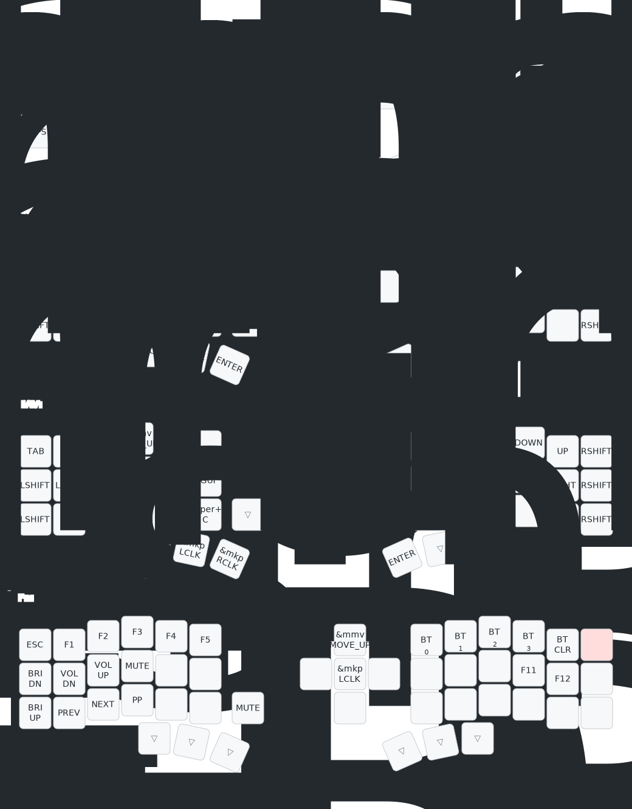

# ZMK Corne 键盘配置

[English](README.md) | [中文](README_CN.md)

Eyeslash Corne 42键分体键盘的自定义 ZMK 固件。

## 键盘版本

| 版本 | 显示屏 | 连接方式 | 固件仓库 | 购买 |
|------|--------|----------|----------|------|
| **Dongle版 (OLED)** | OLED | 键盘 → 接收器 (蓝牙) → Mac (USB) | [zmk-corne-dongle](https://github.com/PAN-Chuwen/zmk-corne-dongle) | [键盘](https://e.tb.cn/h.74bzHdyUEMXPbX6?tk=cd7PfxaLxbs) + [接收器](https://e.tb.cn/h.7VsTwLbeqbA7mkb?tk=IM08fxaOSZd) |
| **Choc版 (LCD)** | nice_view LCD | 右手 → 左手 (蓝牙) → Mac (USB) | [zmk-corne-choc](https://github.com/PAN-Chuwen/zmk-corne-choc) | [淘宝](https://e.tb.cn/h.74bHNHPbyg9pZ7X?tk=Pt48fxaQkwL) |

## 键位图

> 这是我的个人键位配置。Fork 本仓库并编辑 `config/eyeslash_corne.keymap` 来自定义你的键位布局。



## 快速开始

```bash
# 构建固件（触发 GitHub Actions）
./zmk.sh build

# 刷写固件（交互式菜单）
./zmk.sh flash

# 生成键位图
./zmk.sh draw
```

## 功能特性

- **4层键位**: QWERTY、数字/符号、导航、功能键
- **Tap-Dance**: 反引号/波浪号、冒号/分号、引号/双引号
- **组合键**: Q+W = ESC，home row 修饰键组合（S+D = Ctrl 等）
- **宏**: R+G 触发 Ctrl+Space（切换输入法）

## 许可证

MIT
